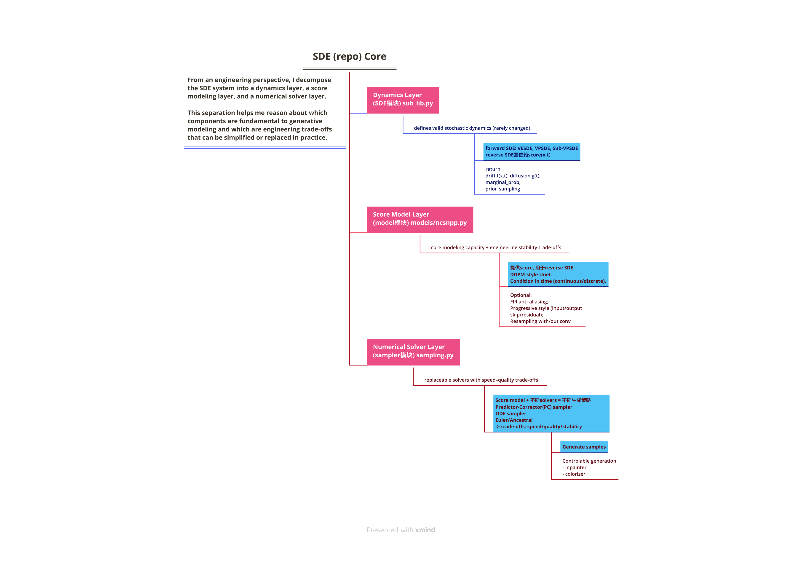
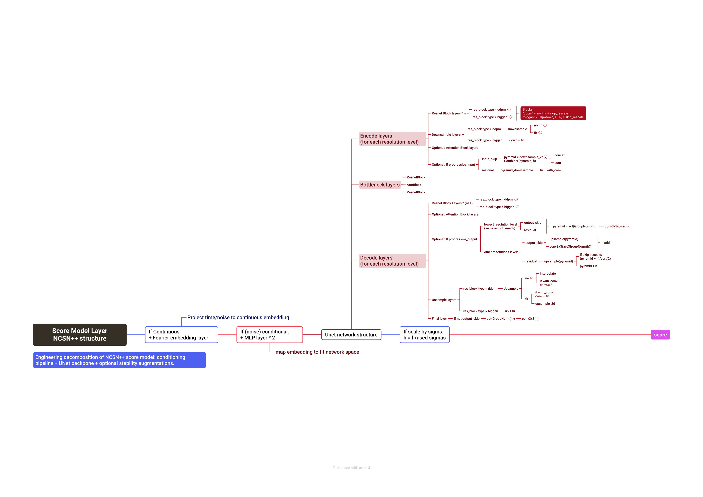
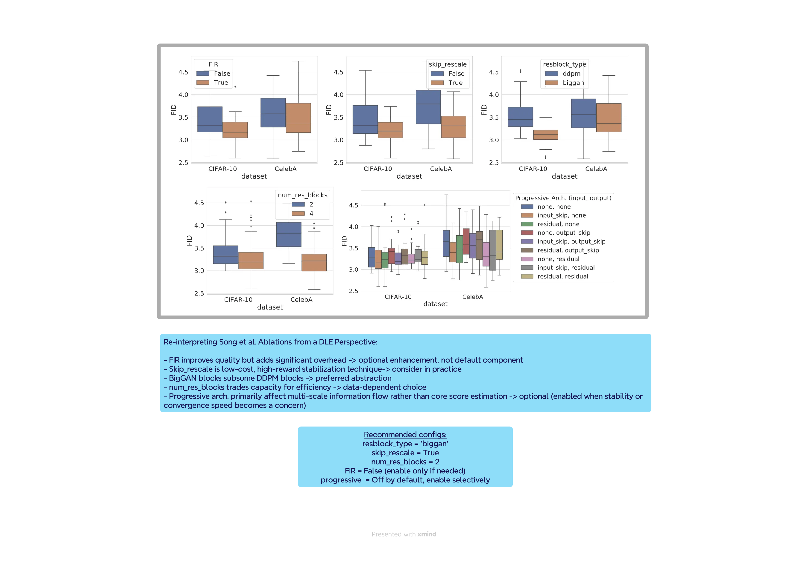
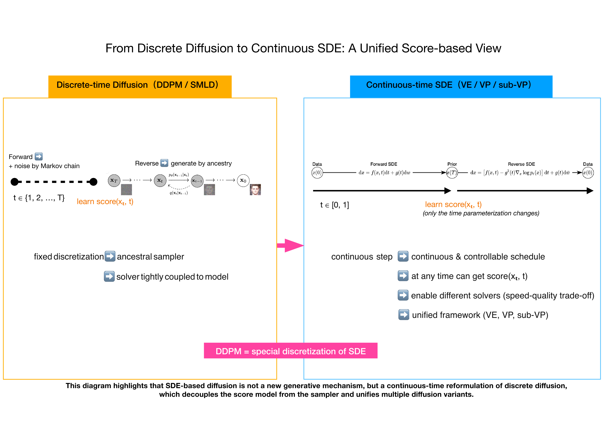

# Score-based SDE: Engineering Understanding & Validation

## TL;DR (Engineering Summary)

- ✔ Deep engineering understanding of Score-Based SDE systems (Song et al., 2021)
- ✔ System-level decomposition of SDE, sampler, and score network
- ✔ Non-invasive validation using official pretrained checkpoints
- ✔ End-to-end GPU sampling + CPU evaluation pipeline
- ✔ Reproducible execution with scripted validation workflow

This repository focuses on **engineering comprehension and execution reliability**, 
not reimplementation or performance benchmarking.

This project reflects how I approach complex research codebases:
understand the system first, validate execution reliability, then reason about design trade-offs.

---

## 1. Background

[Score-Based Generative Modeling via SDEs (Song et al., 2021)](https://arxiv.org/abs/2011.13456) unified multiple diffusion and score-based generative models under a continuous-time SDE framework, enabling:
- VE / VP / sub-VP formulations
- Predictor–Corrector sampling
- Continuous-time score matching
- A principled bridge between SDEs and ODE-based generation

(If interested in more details of theoretical dissections please check my [SDE Paper notes](https://www.notion.so/SDE-294ab1128b408050be83ef8470e48a83?source=copy_link).)

While the paper is mathematically elegant, the accompanying codebase is non-trivial from an engineering perspective, involving:
- multiple frameworks (PyTorch, TensorFlow, JAX)
- continuous vs. discrete-time abstractions
- complex model definitions (NCSN++, DDPM++)
- evaluation pipelines spanning different ecosystems

(If interested in more details of coding dissections please check my [SDE Code notes](https://www.notion.so/SDE-2a9ab1128b4080ed8b2ce93f4e3bb9f8?source=copy_link).)

### What This Project Demonstrates
- ✅ Correct loading of official pretrained checkpoints
- ✅ End-to-end sampling + evaluation execution
- ✅ Practical handling of:
    - PyTorch (sampling, CUDA)
	- ensorFlow + TF-GAN (IS / FID / KID)
	- JAX (dataset & evaluation utilities, CPU-only)
- ✅ Clean, non-invasive engineering validation
- ✅ Reproducible execution via scripted pipeline

Validation is performed on CIFAR-10 using pretrained VE-SDE (NCSN++) and VP-SDE (DDPM++) models.

---


## 2. Engineering Understanding
### Core Architecture Overview

<p align="center">
  
</p>


High-level decomposition of score-based SDE systems into:
- SDE dynamics
- Score network
- Numerical solvers

This separation explains why the same trained score model can be reused across different samplers.


### Score Network (NCSN++) Architecture

<p align="center">
  
</p>


Engineering decomposition of the NCSN++ model:
- time/noise embedding
- UNet backbone
- optional stability and quality augmentations

Many components commonly perceived as “core” are in fact engineering optimizations rather than theoretical necessities.


### Re-interpreting Song et al. Ablations from a DLE Perspective

<p align="center">
  
</p>

Reinterpretation of ablation results studies in Song et al. (2021) as engineering design decisions rather than purely algorithmic improvements.

Each ablation is analyzed in terms of performance gain, stability impact, computational cost, and implementation complexity, highlighting which components are essential for production-grade diffusion systems and which are optional refinements.

Comparison of optional model enhancements and their engineering trade-offs:
- Finite Impulse Response (FIR) filtering - *Improves sampling stability and reduces aliasing at the cost of additional computation in up/down-sampling.*
- Skip connection rescaling - *Stabilizes deep residual networks with minimal computational overhead.*
- BigGAN / DDPM-style residual blocks - *Enhances representational capacity but increases model complexity and memory footprint.*
- Number of residual blocks - *Controls the trade-off between model expressiveness and training/inference cost.*
- Progressive growing framework - *Improves training stability for high-resolution data but introduces significant pipeline complexity.*


### Discrete vs. Continuous Diffusion

<p align="center">
  
</p>


This diagram highlights that SDE-based diffusion is not a new generative mechanism, but a continuous-time reformulation of discrete diffusion, which decouples the score model from the sampler and unifies multiple diffusion variants.

*Note: The full analysis, including diagrams and commentary, is available in 📁 assets/readme_figure/*

---

## 3. Engineering Validation

Understanding alone is insufficient without execution.
This repository therefore includes a minimal, non-invasive engineering validation pipeline.

Why Validation?
- Research code may compile but fail at runtime
- Dependencies may silently break across environments
- Checkpoints may not load as expected
- Sampling and evaluation may diverge from paper assumptions


What Is Validated?
- Loading official pretrained checkpoints
- GPU-based sampling (PyTorch)
- Metric evaluation (IS / FID / KID)
- Cross-framework interaction correctness
- Artifact generation (samples, statistics, reports)

Validation Pipeline:

- All validation logic is isolated under: 📂 engineering_validation/

- See 👉 [engineering_validation/README.md](https://github.com/apple9855/score_sde_pytorch/tree/main/engineering_validation) for detailed how-to execution steps.

---

## 4. Results

Validation is performed on CIFAR-10 using official pretrained checkpoints in [Googledrive](https://drive.google.com/drive/folders/1tFmF_uh57O6lx9ggtZT_5LdonVK2cV-e?usp=sharing).

Models Evaluated:
- VE-SDE (NCSN++)
- VP-SDE (DDPM++)

### Sample Visualization

Both sample grids are generated from the evaluation pipeline.

VE-SDE (NCSN++)
<p align="center">
  
</p>

VP-SDE (DDPM++)
<p align="center">
  
</p>


### Metric Summary
| Model Variant | Checkpoint | Inception Score (↑) | FID (↓) | KID | Time Elapsed |
|--------------|------------|---------------------|---------|-----|--------------|
| VE-SDE (NCSN++) | ckpt-24 | **8.57** | 175.82 | NaN | 317 s |
| VP-SDE (DDPM++) | ckpt-26 | 6.95 | **163.55** | NaN | 171 s |

**Notes:**
- Metrics are reference indicators, not tuned benchmarks
- KID may appear as NaN due to limited evaluation samples
- The goal is pipeline correctness, not metric optimization
- Time elapsed measures end-to-end sampling + evaluation runtime under the same execution environment.
- Runtime numbers are provided for engineering reference only and are **not intended as optimized benchmarks**.
- Differences reflect default sampler configurations and validation settings.

### Environment Snapshot:

- GPU: NVIDIA RTX 4090 (RunPod)
- OS: Linux (containerized)
- Python: 3.11
- PyTorch: 2.x (CUDA-enabled, sampling on GPU)
- TensorFlow / TF-GAN: CPU-only (evaluation metrics)
- JAX: CPU-only (dataset and evaluation utilities)

---

## 5. Notes and Scope
- This repository does not modify core algorithms from the original work
- No retraining is performed
- All credit for methodology belongs to the original authors
- This work focuses on:
    - system comprehension
	- execution validation
	- engineering reliability

- It is intended as a Deep Learning Engineering showcase, not a research contribution.


### References

This repository is an **engineering understanding and validation showcase**
based on the following original work:

```bibtex
@inproceedings{
  song2021scorebased,
  title={Score-Based Generative Modeling through Stochastic Differential Equations},
  author={Yang Song and Jascha Sohl-Dickstein and Diederik P. Kingma and Abhishek Kumar},
  booktitle={International Conference on Learning Representations (ICLR)},
  year={2021},
  url={https://openreview.net/forum?id=PxTIG12RRHS}
}
```
Official implementation: [Github repo](https://github.com/yang-song/score_sde_pytorch)